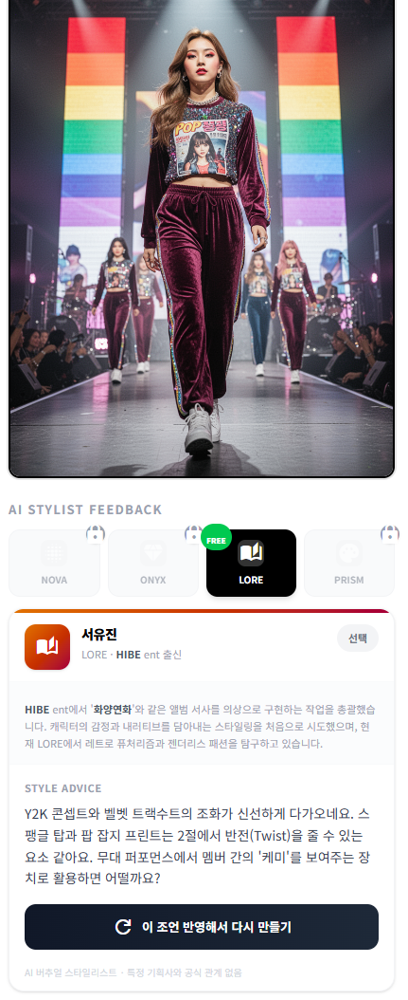

<div align="center">

# MyStyle AI

### *From Prompt to Stage: Design Your Idol's Stage Outfit*

[](https://nextjs.org/)
[](https://www.typescriptlang.org/)
[](https://firebase.google.com/)
[](https://tailwindcss.com/)
[](https://my-style.ai)

**[my-style.ai](https://my-style.ai)**

</div>

---

## Screenshots

<div align="center">
<table>
<tr>
<td align="center"><br /><b>Landing</b></td>
<td align="center"><br /><b>AI Studio</b></td>
<td align="center"><br /><b>Gallery</b></td>
<td align="center"><br /><b>AI Stylist</b></td>
</tr>
</table>
</div>

---

## About

MyStyle AI is an AI-powered platform where K-POP fans design stage outfits, share them in a community gallery, and compete through monthly rankings. The winning design each month is manufactured into a real costume.

### Features

- **AI Studio** — Generate stage outfit designs from text prompts
- **Gallery** — Browse and discover community designs
- **Voting** — Support your favorite designs with likes and boosts
- **Monthly Ranking** — Top designs compete for real costume production
- **AI Stylist** — Get feedback from virtual creative director personas

---

## Tech Stack

| | Technology |
|:---|:---|
| Framework | Next.js 16 (App Router) |
| Language | TypeScript |
| Styling | Tailwind CSS 4 + Framer Motion |
| Backend | Firebase (Auth, Firestore, Storage) |
| AI | fal.ai, Google Gemini |
| Deployment | Vercel |

---

## Development

```bash
git clone https://github.com/beyondfashion-ai/mystyleKPOP.git
cd mystyleKPOP
npm install
cp .env.example .env.local   # fill in your API keys
npm run dev
```

See `.env.example` for required environment variables.

---

## License

ISC

<div align="center">

**[Beyond Fashion AI](https://github.com/beyondfashion-ai)**

</div>
