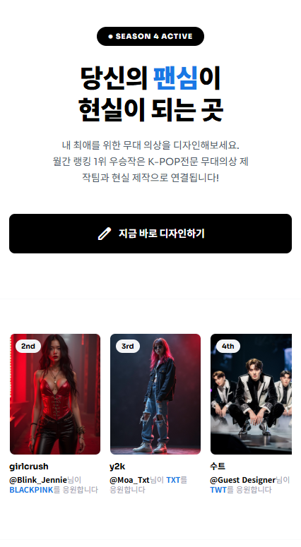
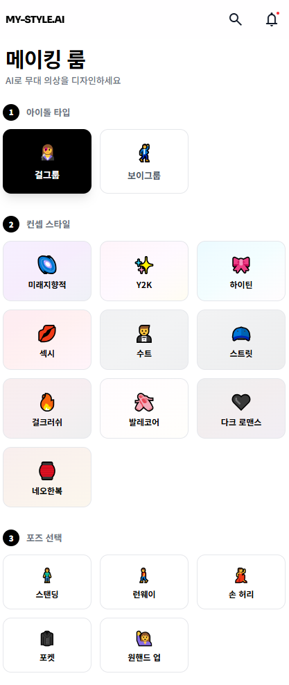
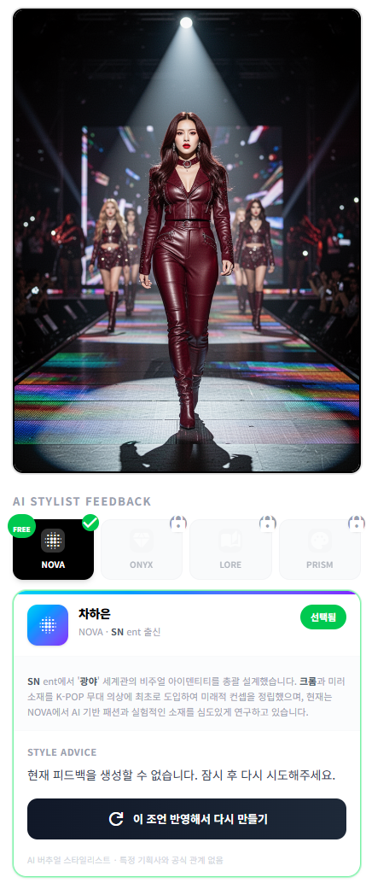
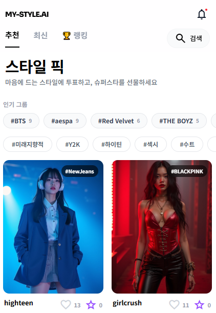
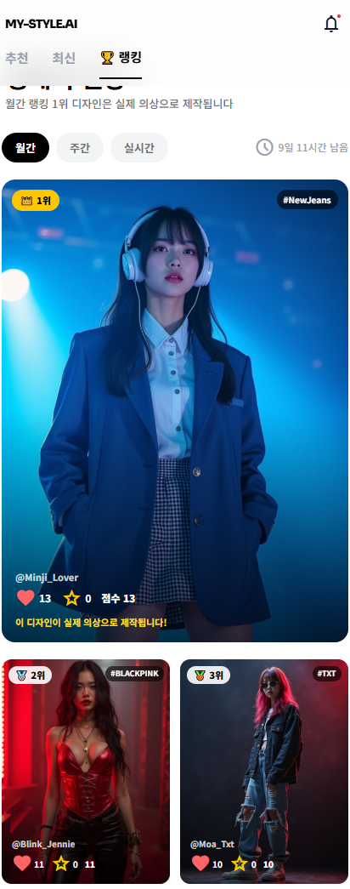
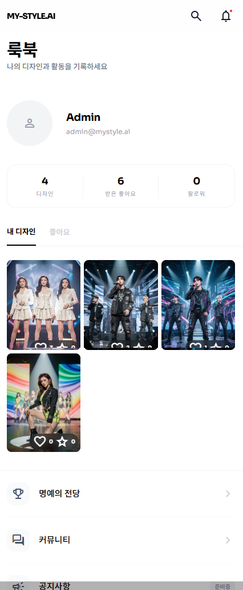

# MY-STYLE.AI — 해커톤 서비스 소개

> **From Prompt to Stage: 팬심을 무대 위로**
> AI로 아이돌 무대의상을 디자인하고, 팬덤이 투표하고, 우승작은 실제 의상으로 제작됩니다.

---

## 💡 Problem

K-POP 팬덤의 창작 에너지는 폭발하지만, 출구가 없습니다.

| 문제 | 설명 |
|------|------|
| **팬아트의 한계** | 그림 실력이 있어야만 창작 가능. 대다수 팬은 "보는 것"에 머무름 |
| **투표만 하는 팬덤** | 음원·영상 투표는 활발하지만, "내가 직접 만든 것"으로 참여하는 구조가 없음 |
| **창작 → 현실 단절** | 팬이 아무리 좋은 아이디어를 내도 실제 제작으로 이어지는 경로 부재 |

---

## 🚀 Solution: Create → Support → Reality

팬이 AI로 무대의상을 만들고, 커뮤니티가 투표하고, 매월 1위 디자인은 실제로 제작합니다.

```
프롬프트 입력 → AI 의상 생성 → 커뮤니티 투표 → 월간 1위 → 실제 의상 제작
```

---

## 📱 유저 저니 & 스크린샷

### 1. 랜딩 페이지 (`/`)


**"당신의 팬심이 현실이 되는 곳"**

- Hero CTA: "지금 바로 디자인하기" → 원클릭으로 메이킹 룸 진입
- Best Picks: 월간 랭킹 상위 디자인 실시간 노출
- 4단계 Journey: 서비스 이용 흐름 안내 (프롬프트 → AI 생성 → 투표 → 제작)

---

### 2. 온보딩 (`/onboarding`)


**나만의 Style DNA 설정**

가입 직후 3단계 설정으로 맞춤 추천 경험을 구성합니다:
1. **선호 아이돌** — 응원하는 그룹을 직접 입력
2. **컨셉 키워드 3개** — 선호 스타일 지정
3. **컬러 팔레트** — 좋아하는 색감 계열

---

### 3. 메이킹 룸 (`/studio`) — 핵심 기능


**AI로 무대의상을 디자인하다**

4단계 입력만으로 프로급 무대의상 이미지가 생성됩니다:

| 단계 | 내용 |
|------|------|
| 1. 아이돌 타입 | 걸그룹 / 보이그룹 |
| 2. 컨셉 스타일 | Cyber, Y2K, 하이틴, 섹시, 네오한복 등 11종 |
| 3. 키워드 + 해시태그 | 자유 텍스트 + #그룹태그 |
| 4. 이미지 생성 | 최대 4장, 포즈/앵글 자동 랜덤화 |

생성 후 대표 이미지를 선택하여 갤러리에 공개하고, 공유 기능으로 바이럴 확산.

---

### 4. AI Virtual Stylist — 차별점


**4명의 가상 Creative Director가 실시간 트렌드 기반 피드백 제공**

| 캐릭터 | MBTI | 스타일 DNA |
|--------|------|-----------|
| 🔷 **NOVA** 차하은 | INTJ | Neo-Culture, Chrome, Y3K |
| ⬛ **ONYX** 윤시혁 | ISTP | Dark Luxury, Power Shoulder |
| 📖 **LORE** 서유진 | INFP | Retro-Futurism, Narrative Wear |
| 🌈 **PRISM** 한도윤 | ENFP | Color Blocking, Sporty-Chic |

- **Gemini 2.0 Flash** + **Google Search Grounding**으로 실시간 K-POP 트렌드 반영
- 1명 무료 열람 + 나머지 3명은 리워드 광고 후 잠금 해제

---

### 5. 스타일 픽 (`/gallery`)


**팬덤이 만든 스타일 갤러리**

- 마소니 그리드 + 무한 스크롤 (12개씩 로드)
- 11개 컨셉 필터 + 인기 그룹 태그
- 낙관적 Like 토글 (탭 한 번으로 즉시 반영)
- 응원 메시지: "@님이 ○○를 응원합니다" 자동 생성

---

### 6. 디자인 상세 (`/design/[id]`)


**응원하고, 공유하기**

- **💖 Like** — 무제한 무료 투표
- **⭐ Superstar** — 10배 가중치 (주 1회)
- **🔗 공유** — KakaoTalk, X, Instagram, 링크 복사
- **🤖 AI 스타일리스트** — 4명 전원 피드백 열람 가능

---

### 7. 명예의 전당 (`/ranking`)


**매월 1위는 현실이 된다 — R2R (Result to Reality)**

- 월간 Top 50 디자인 랭킹
- 1위 디자인은 실제 무대의상으로 제작·배송
- 랭킹 스코어 공식: `Score = Likes + (Superstar × 10)` (공개 투명)
- Like와 Superstar는 항상 분리 표시

---

### 8. 룩북 (`/mypage`)


**나의 룩북**

- 프로필 & 통계 (디자인 수, 받은 Like, 팔로워)
- 내 디자인 / 좋아한 디자인 탭 전환
- Style DNA 편집 (선호 아이돌, 키워드, 컬러 팔레트)

---

## 💰 수익화 로드맵

| Phase | 모델 | 설명 |
|-------|------|------|
| **Phase 1 (현재)** | Likes 기반 랭킹 | 무료 투표, 유저 확보 집중, 일 10회 무료 생성 |
| **Phase 2-A** | AdSense + 무료 크레딧 | 리워드 광고, 미션 크레딧, Boost = 가시성 향상 |
| **Phase 2-B** | 유료 크레딧 + 투표 | PayPal 결제, Boost Vote = 랭킹 직접 반영 |

---

## 🛠 기술 스택

| 영역 | 기술 |
|------|------|
| **Frontend** | Next.js 16 + TypeScript, Tailwind CSS v4, App Router |
| **AI Generation** | fal.ai Flux 2 Turbo (1~4장 동시, 포즈/앵글 랜덤화) |
| **AI Stylist** | Gemini 2.0 Flash + Google Search Grounding |
| **Backend** | Firebase (Firestore, Auth, Storage) + Vercel |
| **Deployment** | Vercel Edge Network, CDN |

---

## 📊 MVP 성공 지표 (3개월)

| 지표 | 목표 |
|------|------|
| 월간 신규 유저 | 5,000 |
| 월간 생성 횟수 | 2,000 |
| 공개 디자인 수 | 600 |
| DAU/MAU 비율 | 30% |

---

## 🏷 Team

**Beyond Fashion AI** · [my-style.ai](https://my-style.ai) · 2026

---

*From Prompt to Stage — 팬심이 무대 위의 현실이 되는 순간*
